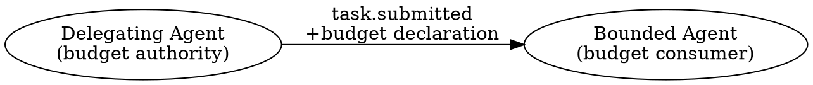
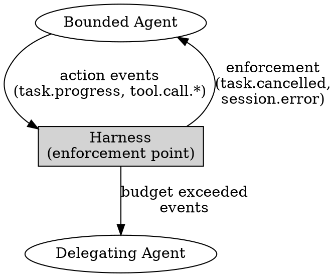

# Harmovela Adaptation Budget Specification

> Status: draft. Part of the 0.5 Adaptation Preview.

## Purpose

Define budget authority (who may establish a budget), the enforcement point (where the budget is checked), and the events emitted when a budget limit is approached or exceeded. Budget semantics provide the economic boundary for L3 production autonomy: a system that adapts must do so within declared, enforced resource limits.

This specification builds on the L1 advisory budget surface in [L1 policy surface](l1-policy-surface.md) and makes it enforceable at L3. The shape of the budget declaration is the same; the difference is that the runtime now checks, enforces, and emits structured events at the protocol boundary.

## Budget Authority

### Who Sets the Budget

Budget authority follows the delegation chain. The **delegating agent** (the agent that dispatches a task to a bounded agent) is the budget authority for that task. This mirrors the ownership model in the [coordination profile](profiles.md#coordination-profile-l2-multi-agent-collaboration-and-delegation): the delegator owns the task and sets its resource boundaries.



A bounded agent may propose a budget in its own `session.ready` capabilities, but the effective budget is always the stricter intersection of the delegator's requirement and the delegate's self-declared limits. The delegator has final authority: if the delegate proposes no budget, the delegator's budget applies; if the delegator proposes no budget, the task is unbounded (advisory at L1, rejected at L3 unless explicitly allowed).

### Budget Establishment Event

The `adaptation.budget.established` event is emitted when an effective budget is agreed for a task or goal. It serves as the authoritative record of the resource contract.

```json
{
  "type": "adaptation.budget.established",
  "id": "evt_budget_est_01",
  "source": "harness:adaptation",
  "created_at": "2026-07-14T10:00:00Z",
  "payload": {
    "scope_type": "task",
    "scope_id": "task_01",
    "goal_id": "goal_ping_cycle_01",
    "budget": {
      "max_cost_usd_millicents": 100000,
      "max_duration_ms": 300000,
      "max_actions": 50
    },
    "authority": {
      "issuer": "agent:supervisor",
      "capability": "budget.establish",
      "granted_at": "2026-07-14T10:00:00Z"
    },
    "delegation_chain": [
      { "agent_id": "agent:supervisor", "role": "delegator" },
      { "agent_id": "agent:pinger",    "role": "delegate" }
    ],
    "established_at": "2026-07-14T10:00:00Z"
  }
}
```

| Field | Type | Required | Description |
| --- | --- | --- | --- |
| `payload.scope_type` | string | yes | The scope of the budget: `task`, `goal`, or `session`. |
| `payload.scope_id` | string | yes | Identifier of the scoped entity. |
| `payload.goal_id` | string | no | The goal identifier if the task serves a declared goal. |
| `payload.budget` | object | yes | The effective budget limits. Same shape as `capabilities.budget`. |
| `payload.authority` | object | yes | The authority under which the budget was established. |
| `payload.authority.issuer` | string | yes | The agent that authorized the budget. |
| `payload.authority.capability` | string | yes | Must be `budget.establish`. |
| `payload.authority.granted_at` | string | yes | ISO 8601 timestamp of the grant. |
| `payload.delegation_chain` | array | yes | Ordered delegation path. |
| `payload.established_at` | string | yes | ISO 8601 timestamp of establishment. |

### Budget Change

A budget may be changed after establishment only by the delegating agent that set it, through a new `adaptation.budget.established` event with an updated `budget` payload. The new event references the prior event via `causation_id`. A bounded agent may request a budget increase through `task.progress` with a `budget_increase_requested` detail, but only the delegator may grant it.

## Enforcement Point

### Where the Budget Is Checked

Budget enforcement is a **runtime-level check** that occurs at the protocol boundary, not in application logic. The enforcement point is the harness (orchestrator) that mediates between the delegating agent and the bounded agent:



The harness maintains a resource counter per scoped budget. Before dispatching each action event from the bounded agent, the harness checks the current counter against the declared budget:

1. If the counter is **below the limit**, the action proceeds.
2. If the counter is **approaching the limit** (within the warning threshold), the harness emits `adaptation.budget.limit_approaching` and lets the action proceed.
3. If the counter **exceeds the limit**, the harness emits `adaptation.budget.limit_exceeded`, blocks the action, and enforces the termination declared in `capabilities.termination.on_budget_exhausted`.

Per-action checks:
- **Cost** (`max_cost_usd_millicents`): Incremented by the declared cost of each tool call or action. Tools must report their cost as part of the `tool.call.completed` payload.
- **Duration** (`max_duration_ms`): Monotonically increasing wall-clock time since the task was started. Checked before each action dispatch.
- **Actions** (`max_actions`): Incremented by 1 for each discrete tool call or event emission within the task scope.

### Warning Threshold

Each budget dimension has a configurable **warning ratio** (default `0.8`). When consumption reaches the warning threshold, `adaptation.budget.limit_approaching` is emitted. The warning ratio may be configured per budget at establishment time:

```json
{
  "payload": {
    "budget": {
      "max_cost_usd_millicents": 100000,
      "max_duration_ms": 300000,
      "max_actions": 50,
      "warning_ratio": 0.75
    }
  }
}
```

A `warning_ratio` of `1.0` disables the warning event (only the exceedance event fires). A `warning_ratio` of `0.0` emits the warning immediately upon the first consumption.

## Budget Events

### `adaptation.budget.limit_approaching`

Emitted when consumption on any budget dimension reaches the warning threshold. This is an advisory signal: the bounded agent is approaching its limit but is not yet blocked.

```json
{
  "type": "adaptation.budget.limit_approaching",
  "id": "evt_budget_app_01",
  "source": "harness:adaptation",
  "created_at": "2026-07-14T10:28:00Z",
  "correlation_id": "task_01",
  "payload": {
    "scope_type": "task",
    "scope_id": "task_01",
    "goal_id": "goal_ping_cycle_01",
    "dimension": "max_actions",
    "declared": 50,
    "consumed": 40,
    "warning_ratio": 0.8,
    "remaining": 10,
    "approaching_at": "2026-07-14T10:28:00Z"
  }
}
```

| Field | Type | Required | Description |
| --- | --- | --- | --- |
| `payload.scope_type` | string | yes | `task`, `goal`, or `session`. |
| `payload.scope_id` | string | yes | Identifier of the scoped entity. |
| `payload.goal_id` | string | no | The goal identifier, if applicable. |
| `payload.dimension` | string | yes | The budget dimension approaching its limit. |
| `payload.declared` | number | yes | The declared limit. |
| `payload.consumed` | number | yes | Current consumption. |
| `payload.warning_ratio` | number | yes | The warning threshold ratio used. |
| `payload.remaining` | number | yes | `declared - consumed`. |
| `payload.approaching_at` | string | yes | ISO 8601 timestamp when the warning threshold was crossed. |

### `adaptation.budget.limit_exceeded`

Emitted when consumption on any budget dimension exceeds the declared limit. This is an enforcement event: the runtime blocks further consumption and enforces the configured termination behavior.

```json
{
  "type": "adaptation.budget.limit_exceeded",
  "id": "evt_budget_exc_01",
  "source": "harness:adaptation",
  "created_at": "2026-07-14T10:32:00Z",
  "correlation_id": "task_01",
  "causation_id": "task_01",
  "payload": {
    "scope_type": "task",
    "scope_id": "task_01",
    "goal_id": "goal_ping_cycle_01",
    "dimension": "max_actions",
    "declared": 50,
    "consumed": 51,
    "enforcement_action": "task_failed",
    "budget_established_event_id": "evt_budget_est_01",
    "exceeded_at": "2026-07-14T10:32:00Z"
  }
}
```

| Field | Type | Required | Description |
| --- | --- | --- | --- |
| `payload.scope_type` | string | yes | `task`, `goal`, or `session`. |
| `payload.scope_id` | string | yes | Identifier of the scoped entity. |
| `payload.goal_id` | string | no | The goal identifier, if applicable. |
| `payload.dimension` | string | yes | The budget dimension that was exceeded. |
| `payload.declared` | number | yes | The declared limit. |
| `payload.consumed` | number | yes | Consumption at the point of exceedance. |
| `payload.enforcement_action` | string | yes | Action taken by the runtime: `task_failed`, `task_cancelled`, `task_escalated`, `session_quarantined`. |
| `payload.budget_established_event_id` | string | yes | The `id` of the `adaptation.budget.established` event that set this budget. |
| `payload.exceeded_at` | string | yes | ISO 8601 timestamp of exceedance. |

### Budget Exhaustion Outcome

When a budget is exceeded, the runtime also emits the more general `adaptation.cost.exceeded` event defined in [adaptation feedback](adaptation-feedback.md). The `adaptation.budget.limit_exceeded` is the enforcement signal; `adaptation.cost.exceeded` is the feedback signal — they carry overlapping but distinct information and serve different consumers.

| Event | Purpose | Primary consumer |
| --- | --- | --- |
| `adaptation.budget.limit_exceeded` | Runtime enforcement record | Harness, delegator (immediate action) |
| `adaptation.cost.exceeded` | Feedback/correlation record | Goal evaluator, audit system (post-hoc analysis) |

## Enforcement Actions

When a budget limit is exceeded, the runtime takes the action configured in `capabilities.termination.on_budget_exhausted`:

| `on_budget_exhausted` | Runtime action | Emitted task event |
| --- | --- | --- |
| `fail` | Mark the task as failed. Block further actions for this task. | `task.failed` with code `budget_exceeded` |
| `cancel` | Cancel the task and propagate cancellation to child tasks. | `task.cancelled` |
| `escalate` | Escalate the task back to the delegating agent. | `task.escalated` |

At L3, `ignore` is not a valid `on_budget_exhausted` value. An implementation that declares `ignore` for budget exhaustion must be rejected during capability negotiation with code `invalid_capability`.

## Multi-Scope Budgets

### Goal-Scoped Budgets

A budget may be established for a goal rather than a single task. A goal-scoped budget is shared across all tasks dispatched toward that goal. The counter accumulates across all tasks:

```json
{
  "type": "adaptation.budget.established",
  "payload": {
    "scope_type": "goal",
    "scope_id": "goal_backup_cycle_01",
    "budget": {
      "max_cost_usd_millicents": 500000,
      "max_duration_ms": 3600000,
      "max_actions": 200
    }
  }
}
```

When a goal-scoped budget is exceeded, all in-flight tasks for that goal are terminated with the configured enforcement action.

### Session-Scoped Budgets

A session-scoped budget is established at `session.ready` negotiation and applies to all tasks within that session. Session-scoped budgets are additive with task-scoped budgets: each task must respect both its own budget and the remaining session budget.

When a session-scoped budget is exceeded, the session enters a terminal state. No new tasks may be accepted. In-flight tasks are terminated per `capabilities.termination.on_budget_exhausted`.

### Budget Precedence

When multiple budget scopes apply, the **tightest effective remaining limit** for each dimension applies. For example, if a task has `max_actions: 50` and the session has 3 actions remaining, the effective limit is 3.

## Audit Trail

All budget events are governance-audited events. The audit record for each budget event includes:

| Field | Source |
| --- | --- |
| Event `id` | Envelope |
| Event `type` | Envelope |
| `scope_type` and `scope_id` | Payload |
| `dimension` | Payload |
| `declared` limit | Payload |
| `consumed` amount | Payload |
| `authority.issuer` | Payload |
| Actor identity (transport) | Transport binding |
| Budget establishment event `id` | Payload (`limit_exceeded` only) |

## L1 → L3 Migration

| Aspect | L1 (advisory) | L3 (enforced) |
| --- | --- | --- |
| Budget declaration | `capabilities.budget` in `session.ready` | Same shape; also emitted as `adaptation.budget.established` |
| Enforcement point | Agent self-checks | Harness checks before each action dispatch |
| Warning signal | Not defined | `adaptation.budget.limit_approaching` |
| Exceedance signal | `task.failed` with `budget_exceeded` (voluntary) | `adaptation.budget.limit_exceeded` + `adaptation.cost.exceeded` (enforced) |
| Authority verification | Not checked | `budget.establish` capability required |
| Multi-scope budgets | Not defined | Goal-scoped and session-scoped budgets with precedence rules |
| Quarantine | Not defined | Runtime may quarantine sessions that exceed budgets |

## Dependencies

- [Event contract](event-contract.md) — envelope validation and routing.
- [L1 policy surface](l1-policy-surface.md) — advisory budget shape that L3 enforces.
- [Governance contract](governance-contract.md) — `budget.establish` and `budget.enforce` authorization checks.
- [Security profile](security.md) — identity, authorization, audit boundaries.
- [Task lifecycle](task-lifecycle.md) — terminal states triggered by budget enforcement.
- [Adaptation feedback](adaptation-feedback.md) — `adaptation.cost.exceeded` feedback event.
