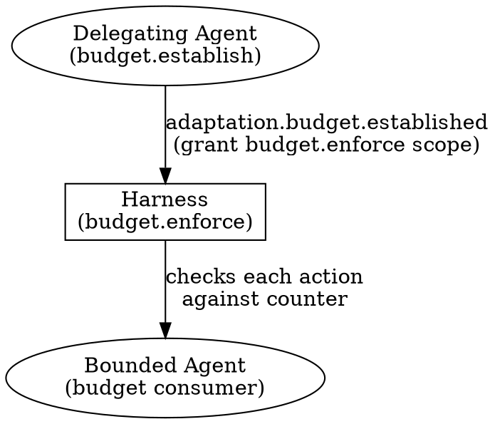

# Harmovela Governance Contract

> Status: draft. Language-neutral contract boundary.

## Ownership

Governance owns identity, authorization, audit, tenant isolation, and policy/budget contracts.

The [security model](security.md) defines the existing identity, authorization, audit, and tenant-isolation behavior. Governance owns the policy and budget decision contracts that apply those concerns across dimensions without duplicating Event envelope or transport behavior.

## Public Contracts

Other dimensions consume Governance decisions through documented interfaces. Runtime ingress and egress enforce those decisions; dimensions do not import Governance internals.

The existing `harmovela.security.v1` Profile supplies the base profile. Future L3 work extends only adaptation-operation controls; it does not expand this contract into other adaptation behavior.

## Adaptation Budget Authorization (L3)

The Governance dimension enforces budget authorization for the L3 adaptation profile. These are adaptation-operation controls that extend the base `harmovela.security.v1` authorization model without duplicating its identity, audit, or tenant-isolation behavior.

### Actions

| Action | Capability | Description |
| --- | --- | --- |
| `budget.establish` | Governance | Authorize creation or modification of a budget for a task, goal, or session. The issuer must be the delegating agent in the delegation chain. |
| `budget.enforce` | Governance | Authorize the runtime (harness) to check consumption counters, block actions, and emit budget-exceeded events. The enforcement point is the harness, which must hold this capability. |

The existing capability scopes (`read:<domain>`, `write:<domain>`, `subscribe:<pattern>`) are insufficient for budget actions, which span multiple domains and involve runtime-level enforcement. The `budget.establish` and `budget.enforce` capabilities are checked at the Governance boundary rather than at the Event routing layer.

### Budget Establishment Authorization

An agent requesting `adaptation.budget.established` must demonstrate the `budget.establish` capability scoped to the target entity. The check verifies:

1. The requesting agent's identity matches the delegation chain (the agent must be the delegator or an authorized parent in the chain).
2. The agent holds `budget.establish` capability for the `scope_type` (`task`, `goal`, or `session`) and the `scope_id`.
3. If modifying an existing budget, the causation chain links to the original budget establishment event.

A request that fails any check is rejected with `event.rejected` (code `unauthorized`, details `missing_capability: budget.establish`).

### Budget Enforcement Authorization

The harness must hold `budget.enforce` to act as the enforcement point. During session capability negotiation:

1. The harness declares `budget.enforce` in its capabilities.
2. The delegating agent grants the harness authority through `budget.establish` for the specific budget scopes.
3. The harness checks counter state before each action dispatch. If the harness lacks `budget.enforce` for a scope, it must not enforce budget limits for that scope and must emit `session.error` with code `missing_capability` and details `budget.enforce`.

### Budget Authorization in Delegation Chains

Budget authorization follows the delegation chain established by the [coordination profile](profiles.md#coordination-profile-l2-multi-agent-collaboration-and-delegation):

- The **original delegator** holds `budget.establish` and delegates it to the harness via the budget establishment event.
- The **intermediate delegate** may sub-delegate the task but may not increase the budget beyond the parent's declared limit. A sub-delegation that requests a higher budget must be rejected.
- The **harness** (enforcement point) holds `budget.enforce` and checks every action against the effective budget for each scope.
- Budget authorization revocation follows the same escalation path as delegation revocation.

## Dependencies

Governance depends only on Event contracts.
